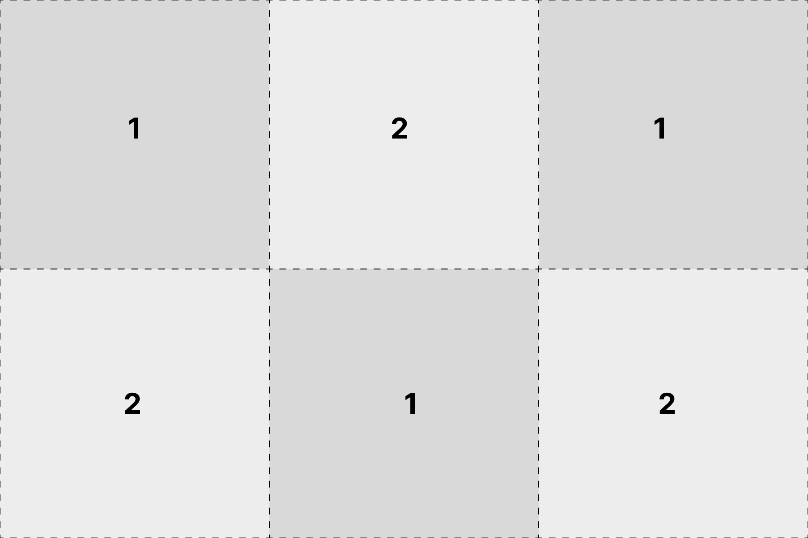
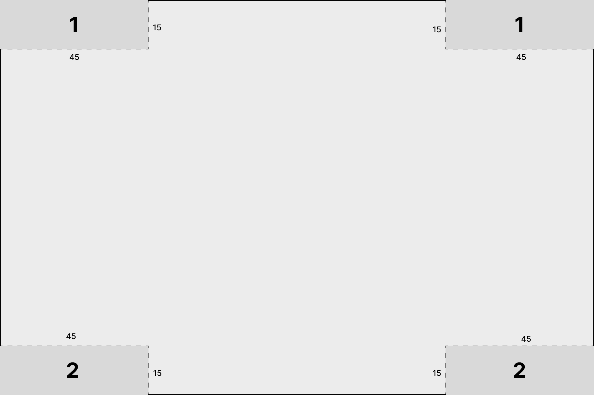
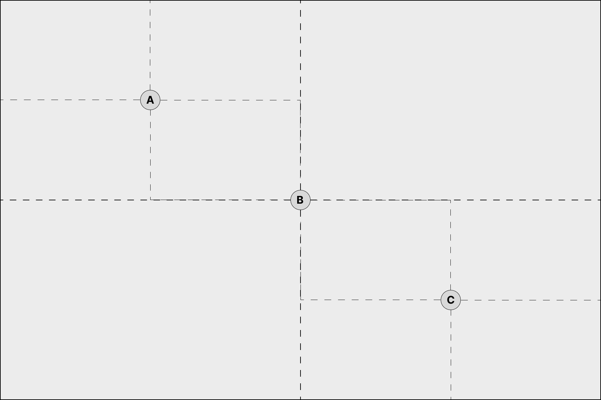
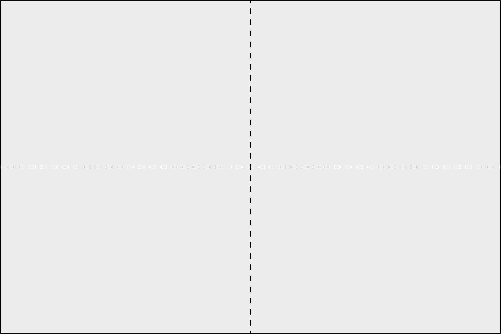

# Эпическая Система Сценариев

Если вы с одной стороны, хотите больше разнообразия, а с другой - больше регламентации в своих играх в эпик, эта система для вас.

Сценарии по умолчанию рассчитаны на две стороны. Если вы играете более одного игрока на сторону, перед игрой договоритесь о степени участия разных игроков в выборе сценария и порядке активации.

Сценари по умолчанию рассчитаны на стол 120х180см. Если у вас более крупный стол, пропорционально увеличьте расстояния и колчество ландшафта.

Предполагается, что фракцию игроки выбирают до выбора сценария, а армию после. Однако, никто не хочет высчитывать тысячи очков у стола в клубе. Поэтому, хорошим решением будет пару ростеров на все случаи жизни, и запасной ростер для наиболее радикальных сценариев, вроде интерьера.

Первым игроком автоматически становится сторона с более высоким стратегическим рейтингом.

У вашего сценария будет 5 параметров: ландшафт, расстановка, длительность, условия победы, спецправила.
Есть два способа их выбрать: _случайный_ и _стратегический_.
При _случайном_ просто бросьте кубик за каждый параметр.
При стратегическом, выбирайте их последовательно. На каждый из параметров каждый игрок бросает кубик и прибавляет стратегический рейтинг. Выкинувший больше выбирает опцию на свой выбор, а второй игрок получает +1 на следующий бросок выбора.
Игрок, выбравший меньше параметров, получает +2 на бросок в стратегическую фазу первого хода.

## Ландшафт

<!--
Лос-блоками называются либо здания или руины выше 5 см, либо леса или иные элементы, о которых игроки заранее договорятся, что они препятствуют обзору. -->

Как штука элемента ландшафта считается область от 15 до 30 см в диаметре. Если у вас более мелкие элементы, можете ставить их рядом, чтобы получить один элемент расстановки. Элементы от 30 до 45 считаются за два. Река считается за столько секторов стола 60х60, через сколько она течет, а дороги считаются за ноль, и каждый из игроков в конце расстановки ландшафта может поставить одну дорогу при любом способе.

#### 1. Универсальный способ

Игроки выбирают длинные стороны стола.
Игроки кидают по 3д6 и втайне от противника выбирают одно или два из значений, затем вскрываются. Сумма значений двух игроков - это итоговое колчество элементов на столе. Затем игроки по-очереди начиная с первого выставляют по одному элементу на выбор. Элементы выставляются не ближе 15см от уже выставленных элементов. После того, как нужное число элементов выставлено на стол, каждый игрок начиная с первого может передвинуть один элемент до 15см.

#### 1. Коллективная работа

Первый игрок кидает 2 или 3 д6 и выбирает такое количество элементов ландшафта, затем второй игрок их выставляет на стол и выбирает длинную сторону стола.

#### 3. Наброс по секторам

Игроки выбирают длинные стороны стола.
Стол делится на сектора 60х60см, которые в шахматном порядке делятся между игроками.
Игроки кидают д3 за каждый из своих секторов стола и выставляют туда столько элементов по своему усмотрению. Элементы не должны стоять ближе, чем в 15см друг от друга.

#### 4. Засада

Первый игрок кидает 4д6 и выбирает 3 значения по своему выбору, а затем выставляет столько элементов на свое усмотрение, не ближе 15см друг от друга.

Затем, второй игрок может выбрать любую из 4х сторон стола. Противнику достается противоположная.

#### 5. Город

Игроки выбирают короткие стороны стола.
В центральном секторе стола каждый игрок выставляет 3-6 зданий или руин, по-очереди.
После этого каждый игрок выставляет вне города до д3 эелементов по своему усмотрению.

#### 6. Страна холмов

Игроки выбирают длинные стороны стола.
Стол делится на сектора 60х60см, которые в шахматном порядке делятся между игроками. Каждый из игроков выставляет в секторе холм, не ближе 10см от краев сектора.
После этого, каждый игрок может выставить д3+1 элементов по своему усмотрению.

## Расстановка

Во всех вариантах расстановки используется правило Гарнизоны из NetEA Tournament Pack

#### 1. Обычная

Расстояние между зонами расстановки 90см.
Игроки, начиная с первого, выставляют по-очереди по одной формации.

#### 2. Смена сторон

Игроки сдвигаются направо с длинной стороны на короткую или наоборот.
(Если игроки стояли по коротким сторонам, теперь они будут по длинным. Если они были по длинным, теперь будут по коротким.)
Далее обычная расстановка.

#### 3. Эскалация

Расстояние между зонами расстановки 90см.
Перед началом игры выставляются только гарнизоны, все остальные формации кроме резервов (телепорт, дроп-поды) начинают "на подходе". В свою инициативу игрок может вместо активации одной из формаций на поле вывести одну из формаций на подходе. Он обязан выбрать приказ, включающий движение, и движение измеряется от любой точки своей стороны стола. Игрок не обязан выводить формации, но если у него нет более отрядов для активации, он должен спасовать, и не может более выводить в этом ходу.
Все формации, не выведенные до конца игры, считаются уничтоженными.

#### 4. Близкий контакт

Расстояние между зонами расстановки 45см.
Игроки, начиная с первого, выставляют по-очереди по одной формации.

#### 5. Высадка

Для расстановки целей будут использованы уже выбранные стороны стола.
Первый игрок делит армию на две части по количеству формаций.
Первый игрок выбирает точку высадки на _любой_ стороне стола и выставляет половину войск в 45см от нее.
Второй игрок выбирает точку высадки не ближе чем в 75 см от точки первого игрока и выставляет всю армию в 45см от нее и не ближе чем в 30см от отрядов противника.
Затем первый игрок выставляет вторую половину армии в 45см от своей точки высадки и не ближе чем в 30см от отрядов противника.

#### 6. Клещи

Если игроки стоят по длинным сторонам, ничего не меняется. Если они по коротким, они сдвигаются направо, чтобы быть по длинным.
Зоны расстановки в 90см от противника и в 45см от коротких сторон стола.

Игроки, начиная с первого, выставляют по-очереди по одной формации.

## Длительность

#### 1-2. Стандарт

Если после 3-х ходов условия победы не выполнены, играется 4-й.

#### 3. Блиц

Если после 2-х ходов условия победы не выполнены, играется 3-й.

#### 4. Долгая

Если после 4-х ходов условия победы не выполнены, играется 5-й.

#### 5. По разница очков

Если на 2й ход и далее на конец хода одна из сторон выполняет условия победы, она побеждает.
Если на 4й ход никто не победил, это ничья.

## Цели

В некоторых сценариях используется [стандартная расстановка 6 целей](https://tp.net-armageddon.org/tournament-pack/#place-objective-markers) из NetEA tournament pack и цели оттуда же:

- Блицкриг: захват цели на стороне противника
- Сломать дух: уничтожена самая дорогая формация противника
- Защитить флаг: захват всех целей на своей стороне стола
- Взять и удержать: захват двух точек на стороне стола противника
- Ты не пройдешь: на вашей стороне нет не сломленных формаций противника

Тайбрейкер по очкам считается так, как указано в [NetEA tournament pack](https://tp.net-armageddon.org/tournament-pack/#victory-conditions):

- Полные очки за формации, которые уничтожены, либо сломленны и потеряли половину или более отрядов
- Половину очков за формации, которые потеряли половину или более отрядов _или_ сломлены
  Если разница по очкам менее 500, это ничья.

#### 1. Стандарт

Расставьте цели стандартным методом.
По 1 победному очку дается за выполнение стандартных целей на момент подсчета. Игрок побеждает, если у него 3 очка, и больше очков, чем у противника.
Если победителя к концу игры нет, считайте тайбрейкер по очкам.

#### 2. Стандарт продолжительный

Расставьте цели стандартным методом.
В конце каждого хода каждый игрок получает очки за выполнение стандартных целей.
Если в конце игры у игрока на 3 или более очков больше, чем у противника, он побеждает.
Если победителя к концу игры нет, считайте тайбрейкер по очкам.

УТОЧНЕНИЕ: если на первый ход убил противнику самую дорогую формацию, он продолжает получать очко за это и в другие ходы, пока идет игра.

#### 3. Устрашение

Расставьте цели стандартным методом.
По 1 победному очку дается за выполнение стандартных целей на момент подсчета.
Так же, 1 очко игрок получает каждый раз, когда формация противника _сломлена_.
Игрок побеждает, если у него на 3 или более очка больше в конце игры, чем у противника.
Если победителя к концу игры нет, считайте тайбрейкер по очкам.

#### 4. Резня

Если у противника на поле в любой момент не осталось не сломленных войск, вы побеждаете.
Если победителя к концу игры нет, считайте тайбрейкер по очкам.

#### 5. Захват флагов

Выставьте цели по схеме

В конце каждого хода, игрок получает 1 очко за контроль каждого флага.
Игрок побеждает, если у него на 3 или более очка больше в конце игры, чем у противника.
Если победителя к концу игры нет, считайте тайбрейкер по очкам.

#### 6. Захват территории

В конце каждого хода, получайте 1 очко за каждую четверть стола, на которой есть ваши несломленные войска, и нет вражеских. Формация считается в той четверти, в которой стоит большая часть ее отрядов, то есть нельзя засчитать одной формацией две и более четвертей.

Игрок побеждает, если у него на 3 или более очка больше в конце игры, чем у противника.
Если победителя к концу игры нет, считайте тайбрейкер по очкам.

## Спецправила

#### 1. Генеральное сражение

Без спецправил.

#### 2. Засучив рукава.

Если в листе армии есть линейные или основные отряды, они получают спецправило "Засучив рукава". Если в листе армии такого нет, это спецправило получает пехота.

Если в 15см от цели находится не сломленный отряд с спецправилом "Засучив рукава", игнорируйте для определения контроля цели все отряды без этого правила в 15см от этой цели.

#### 3. Неразбериха

Штраф к тесту на инициативу при удержании не -1, как обычно, а -3.

#### 4. Зыбучие пески

Отряды без правил skimmer и jetpack, которые не двигаются в ходе своей активации, после ее завершения должны пройти тест на опасный ландшафт.

#### 5. Перед рассветом

Игра начинается ночью

- Линия видимости ограничена 30см
- Используя indirect fire, отряды не могут попадать лучше, чем на 6+
- Самолеты попадают по наземным целям не лучше, чем на 6+

В конце хода первый игрок кидает кубик. На 3+ ночь заканчивается.

#### 6. Опасные земли

Все элементы ландшафта, опасные для техники, так же становятся опасными для пехоты.
