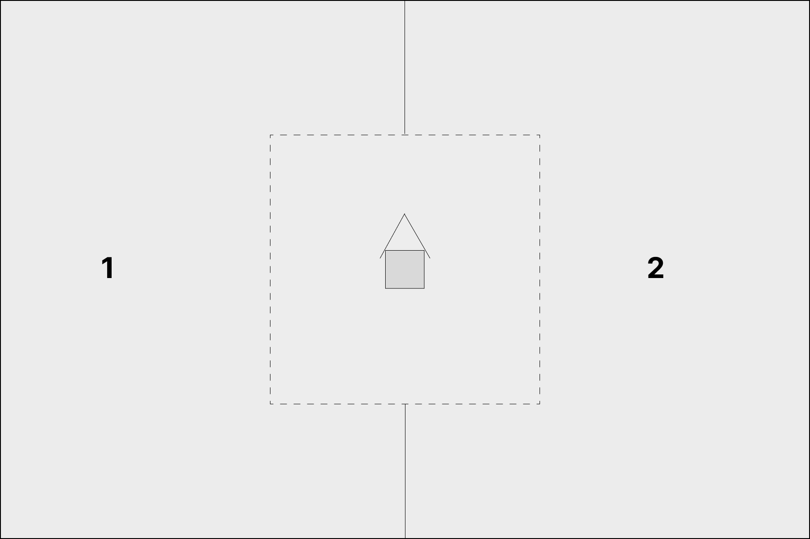

# Эпическая Система Сценариев

Если вы с одной стороны, хотите больше разнообразия, а с другой - больше регламентации в своих играх в эпик, эта система для вас.

Сценарии по умолчанию рассчитаны на две стороны. Если вы играете более одного игрока на сторону, перед игрой договоритесь о его участии в сценарии и порядке активации.

Сценари по умолчанию рассчитаны на стол 120х180см. Если у вас более крупный стол, пропорционально увеличьте расстояния и колчество ландшафта.

Первым игроком автоматически становится сторона с более высоким стратегическим рейтингом.

У вашего сценария будет 5 параметров: ландшафт, расстановка, длительность, условия победы, спецправила.
Есть два способа их выбрать: _случайный_ и _стратегический_.
При _случайном_ просто бросьте кубик за каждый параметр.
При стратегическом, выбирайте их последовательно. На каждый из параметров каждый игрок бросает кубик и прибавляет стратегический рейтинг. Выкинувший больше выбирает опцию на свой выбор, а второй игрок получает +1 на следующий бросок выбора.
Игрок, выбравший меньше параметров, получает +2 на бросок в стратегическую фазу первого хода.

## Ландшафт

Лос-блоками называются либо здания или руины выше 5 см, либо леса или иные элементы, о которых игроки заранее договорятся, что они препятствуют обзору.
Как штука элемента террейна считается область от 15 до 30 см в диаметре. Если у вас более мелкие элементы, можете ставить их рядом, чтобы получить один элемент расстановки. Элементы от 30 до 45 считаются за два. Река считается за столько элементов, через сколько она течет, а дороги считаются за ноль, и каждый из игроков в конце расстановки ландшафта может поставить одну дорогу.

Перед выбором способа расстановки террейна игроки закрепляют за собой стороны стола.

#### 1-2. Универальный способ

Игроки кидают по 3д6 и втайне от противника выбирают одно или два из значений, затем вскрываются. Сумма значений двух игроков - это итоговое колчество элементов на столе. Затем игроки по-очереди начиная с первого выставляют по одному элементу на выбор. Элементы выставляются не ближе 15см от уже выставленных элементов. После того, как нужное число элементов выставлено на стол, какждый игрок начиная с первого может передвинуть один элемент до 15см.

#### 3. Наброс по секторам

Стол делится на сектора 60х60см, которые в шахматном порядке делятся между игроками.
Игроки кидают д3 за каждый из своих секторов стола и выставляют туда столько элементов по своему усмотрению. Элементы не должны стоять ближе, чем в 15см друг от друга.

#### 4. Засада

Первый игрок кидает 4д6 и выбирает 3 значения по своему выбору, а затем выставляет столько элементов на свое усмотрение, не ближе 15см друг от друга.

Затем, второй игрок может выбрать любую из 4х сторон стола. Противнику достается противоположная.

#### 5. Город

В центральном секторе стола каждый игрок выставляет 3-6 зданий или руин, по-очереди.
После этого каждый игрок выставляет вне города до д3 эелементов по своему усмотрению.

#### 6. Страна холмов

Стол делится на сектора 60х60см, которые в шахматном порядке делятся между игроками. Каждый из игроков выставляет в секторе холм, не ближе 10см от краев сектора.
После этого, каждый игрок может выставить д3+1 элементов по своему усмотрению.

## Расстановка

#### Обычная

#### Короткие стороны

#### Эскалация

#### Близкий контакт

#### Высадка

#### Клещи

## Длительность

#### Стандарт

#### Блиц

#### Долгая

#### По разница очков

## Цели

#### Стандарт

#### Стандарт продолжительный

#### Устрашение

#### Резня

#### Захват флагов

#### Захват территории

## Спецправила

#### Эскалация

#### Неразбериха

#### Интерьер

#### Генеральное сражение

#### Перед рассветом

#### Опасные земли
